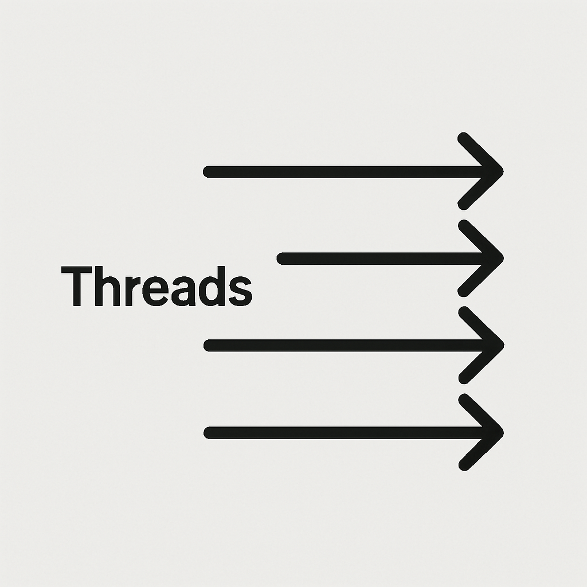

<p align="center">
    <a href="" target="_blank">
      
    </a>
</p>
<h1 align="center">thread-design-pattern</h1>
<p align="center"><strong>多线程设计模式<br><em>持续更新中～</em></strong></p>
<div align="center">
    <a href="https://github.com/AlfonsoKevin/thread-design-pattern"></a></div>

## 介绍😎

---

总结JUC学习当中关于线程的设计模式


## 项目目录📇

```txt
└─📁 io
  └─📁 github
    └─📁 alfonsokevin
      └─📁 design1            # 设计模式1两阶段终止
```


## 食用指南🧭

总结在个人学习JUC的时候使用到的设计模式。通过设计模式JUC进行学习和巩固。此笔记是渐入式学习，使得刚开始学习JUC的人也能够随着学习的进度看懂大多数内容。当然也会结合现在市面上常见的面试题，手写一些多线程的知识。

- [两阶段终止](./src/main/java/io/github/alfonsokevin/design1/doc/README1.md)
- 

目前还在开发中，敬请期待。

## 注意事项👌


------

感谢您对该项目的关注和支持！🕵️‍♀️
