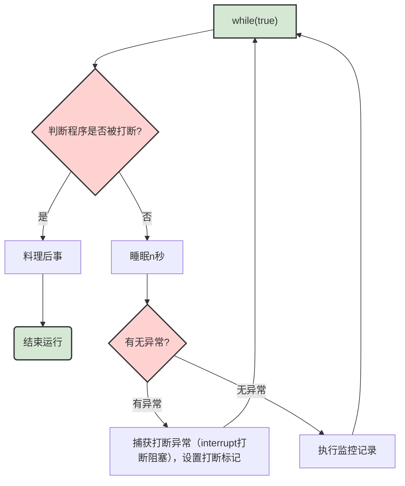

## 两阶段终止

---

在一个线程 T1 中如何**“优雅”**终止线程 T2？这里的【优雅】指的是给 T2 一个料理后事的机会。

- 使用线程对象的 stop() 方法停止线程
  stop 方法会真正杀死线程，如果这时线程锁住了共享资源，那么当它被杀死后就再也没有机会释放锁，其它线程将永远无法获取锁
- 使用 System.exit(int) 方法停止线程
  目的仅是停止一个线程，但这种做法会让整个程序都停止

> 现在我们有一个场景就是，假设我们需要设计一个监控系统，用于监控程序的CPU使用，运行的信息等。对于这个监控系统，我们就可以使用两阶段中终止。监控系统中会用到监控线程，监控线程`while(true)`每隔一段时间，就会去扫描程序中的运行信息。既然有`while(true)`考虑到线程如果程序中止了，也要优雅退出。

